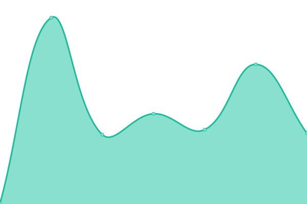

# [📈 Live Status](https://licenseware.github.io/uptime): <!--live status--> **🟧 Partial outage**

This repository contains the open-source uptime monitor and status page for [Licenseware](https://licenseware.io/), powered by [Upptime](https://github.com/upptime/upptime).

With [Upptime](https://upptime.js.org), you can get your own unlimited and free uptime monitor and status page, powered entirely by a GitHub repository. We use [Issues](https://github.com/licenseware/uptime/issues) as incident reports, [Actions](https://github.com/licenseware/uptime/actions) as uptime monitors, and [Pages](https://licenseware.github.io/uptime) for the status page.

<!--start: status pages-->
<!-- This summary is generated by Upptime (https://github.com/upptime/upptime) -->
<!-- Do not edit this manually, your changes will be overwritten -->
<!-- prettier-ignore -->
| URL | Status | History | Response Time | Uptime |
| --- | ------ | ------- | ------------- | ------ |
|  [Application - EU](https://app.licenseware.io) | 🟩 Up | [application-eu.yml](https://github.com/licenseware/uptime/commits/HEAD/history/application-eu.yml) | 

 231ms
     
 | 

<a href="https://status.licenseware.io/history/application-eu">100.00%</a>
    

|  [Backend - EU](https://api.licenseware.io/licenseware/) | 🟩 Up | [backend-eu.yml](https://github.com/licenseware/uptime/commits/HEAD/history/backend-eu.yml) | 

 516ms
     
 | 

<a href="https://status.licenseware.io/history/backend-eu">100.00%</a>
    

|  [Application - US](https://us.licenseware.io) | 🟥 Down | [application-us.yml](https://github.com/licenseware/uptime/commits/HEAD/history/application-us.yml) | 

 192ms
     
 | 

<a href="https://status.licenseware.io/history/application-us">80.44%</a>
    

|  [Backend - US](https://api.us.licenseware.io/licenseware/) | 🟥 Down | [backend-us.yml](https://github.com/licenseware/uptime/commits/HEAD/history/backend-us.yml) | 

 324ms
     
 | 

<a href="https://status.licenseware.io/history/backend-us">79.62%</a>
    

|  [Application - AU](https://au.licenseware.io) | 🟩 Up | [application-au.yml](https://github.com/licenseware/uptime/commits/HEAD/history/application-au.yml) | 

 401ms
     
 | 

<a href="https://status.licenseware.io/history/application-au">100.00%</a>
    

|  [Backend - AU](https://api.au.licenseware.io/licenseware/) | 🟩 Up | [backend-au.yml](https://github.com/licenseware/uptime/commits/HEAD/history/backend-au.yml) | 

 816ms
     
 | 

<a href="https://status.licenseware.io/history/backend-au">100.00%</a>
    

|  [Landing page](https://licenseware.io) | 🟩 Up | [landing-page.yml](https://github.com/licenseware/uptime/commits/HEAD/history/landing-page.yml) | 

 1783ms
     
 | 

<a href="https://status.licenseware.io/history/landing-page">100.00%</a>
    

|  [Accenture Instance](https://licenseware.primequantract.com/) | 🟩 Up | [accenture-instance.yml](https://github.com/licenseware/uptime/commits/HEAD/history/accenture-instance.yml) | 

 516ms
     
 | 

<a href="https://status.licenseware.io/history/accenture-instance">98.15%</a>
    

<!--end: status pages-->

[**Visit our status website →**](https://licenseware.github.io/uptime)

## 📄 License

- Powered by: [Upptime](https://github.com/upptime/upptime)
- Code: [MIT](./LICENSE) © [Licenseware](https://licenseware.io/)
- Data in the `./history` directory: [Open Database License](https://opendatacommons.org/licenses/odbl/1-0/)
